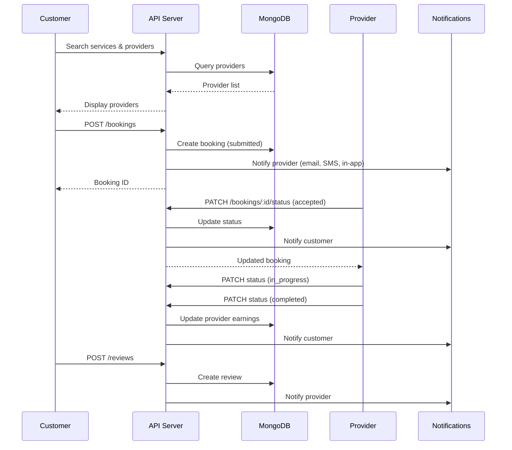
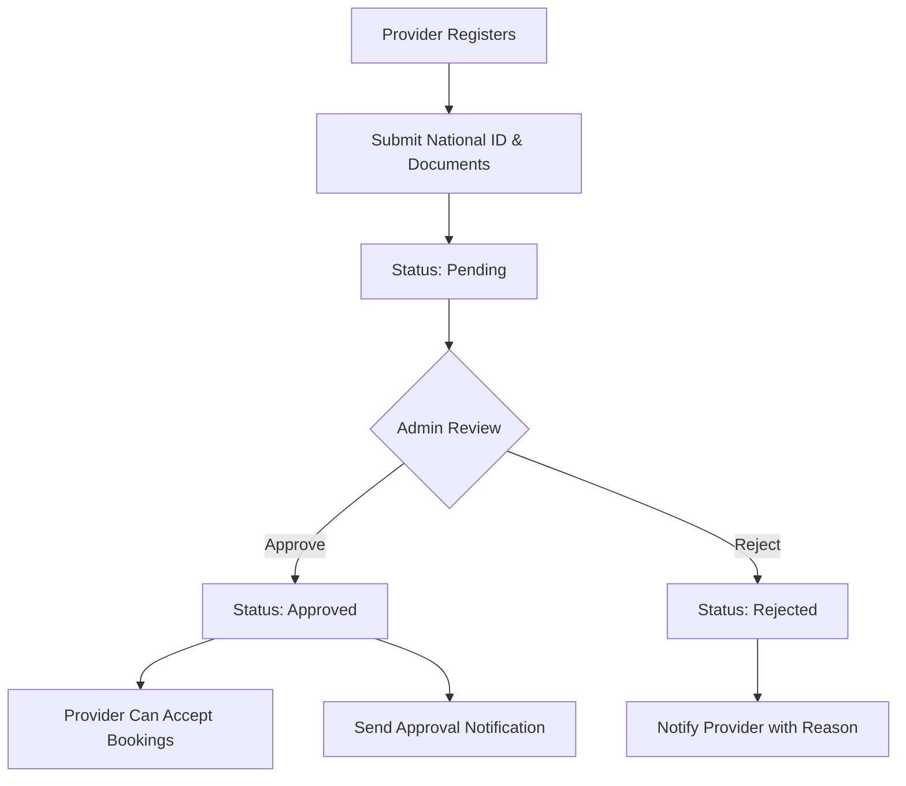
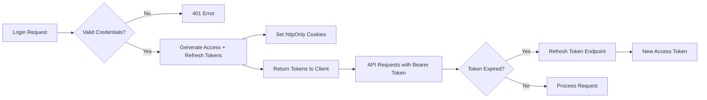

# Farsamo Platform - Workflows

## Booking Workflow

## Provider Verification Workflow

## Authentication Flow

## Admin Workflow

1. **Dashboard** - View platform analytics and growth metrics
2. **User Management** - CRUD customers and providers, activate/deactivate
3. **Verification** - Review provider documents, approve/reject
4. **Service Management** - CRUD categories and services
5. **Booking Oversight** - Monitor all bookings and statuses
6. **Review Moderation** - Approve, reject, or delete reviews
7. **Reports** - Export users, providers, bookings, revenue (PDF/Excel)
8. **Settings** - Configure platform name, contact info, commission rate

## Notification Flow

| Event | Channels | Recipients |
|-------|----------|------------|
| Registration | Email | New user |
| Provider Approval | Email, SMS, In-App | Provider |
| Booking Created | Email, SMS, In-App | Provider |
| Booking Accepted | Email, SMS, In-App | Customer |
| Booking Rejected | Email, SMS, In-App | Customer |
| Booking Completed | Email, SMS, In-App | Customer |
| New Review | Email, In-App | Provider |
